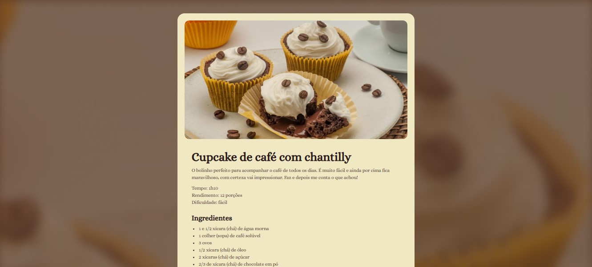

# Pagina de receitas

Um projeto desenvolvido durante o curso Fullstack da Rocketseat, com foco no aprendizado de HTML, CSS e uso do Figma para criação do design.

## 🛠️ Construído com

*  Construção da estrutura
*  Estilização da página

## ✒️ Autores

* **Línicker Ostroski Mota** 
